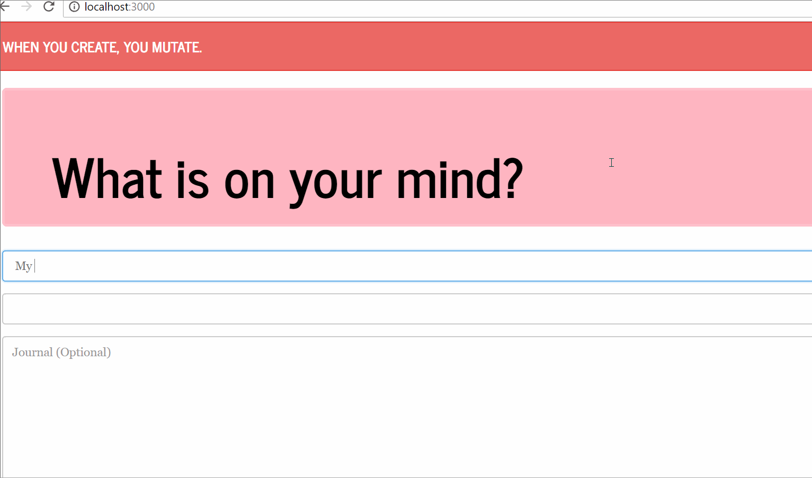

#    :scroll: Create & Mutate :scroll:

### A FREE place to record your thoughts, feelings and ideas.You can use it as frequently or infrequently as you would like. This is your space to write down whatever is on your mind. You have the power to edit and delete the thoughts ones you have created it.

## “Write down the thoughts of the moment. Those that come unsought for are commonly the most valuable. ”   - Francis Bacon, Sr.


  ##Architecture Diagram - MVC

  ```
  ├───Client
  │   ├───public
  │   └───src
  │       ├───components
  │       │   ├───DeleteBtn
  │       │   ├───Form
  │       │   ├───Grid
  │       │   ├───Jumbotron
  │       │   ├───List
  │       │   └───Nav
  │       ├───pages
  │       │   ├───Detail
  │       │   ├───Jornals
  │       │   └───NoMatch
  │       └───utils
  │            └───API.js
  ├───controllers
  │          └───journalsController.js
  ├───models
  │       ├───index.js
  │       └───journal.js
  ├───routes
  │       ├───api
  │       │   ├───index.js
  │       │   ├───jornals.js
  │       └───index.js
  |
  ├───scripts
  │       ├───build.js
  │       ├───SeedDB.js
  │       └───start-client.js
  ├── .gitignore
  ├── nodemon
  ├── package.json
  ├── Procfile
  ├── README.md
  ├── server.js
  └── yarn.lock

  ```
## Prerequisites :computer:
- :link: [NPM](https://docs.npmjs.com)  
- :link:Express
- :link:Body-parser
- :link:bcrypt-nodejs
- :link: mongoose

## Key Features
##Blog
##Journal Entry
##Tech Used
- express
- React
- heroku
- HTML
- css
- markdown
- Mongo
- bcrypt-nodejs
- Yarn
- Node.js
- Express.js
- Bootstrap
- HTML
- Javascript
- jQuery
- CSS





##API Docs
- get
- post
- update
- delete

##Getting Started
go to Journal

#created by : Bezawit Teferi
## Create & Mutate
[Bezawit](https://github.com/bteferi)  
